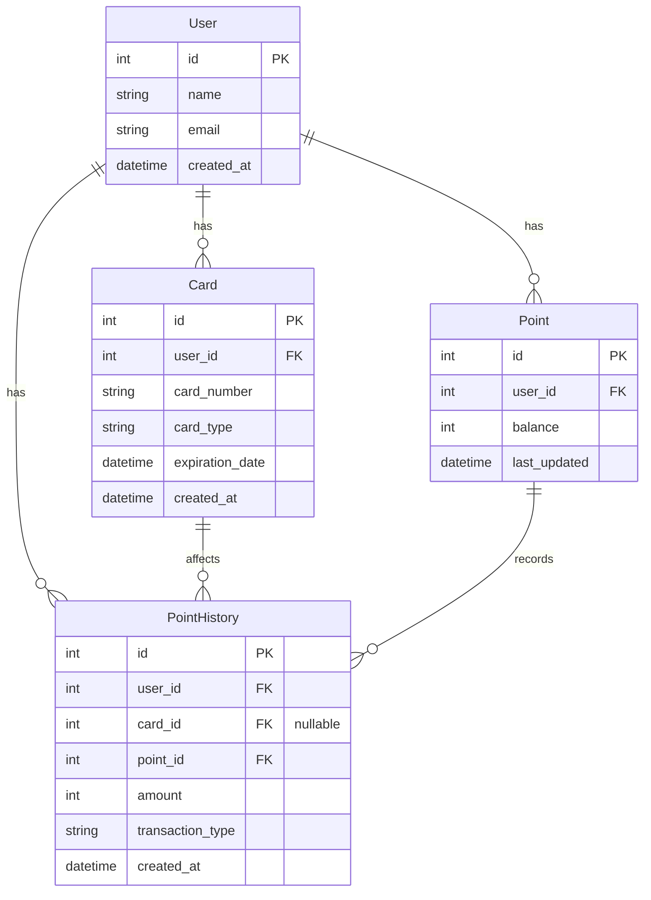

# mermaid diagram
- diagram by text

```mermaid
erDiagram
    User ||--o{ Card : has
    User ||--o{ Point : has
    User ||--o{ PointHistory : has
    Card ||--o{ PointHistory : affects
    Point ||--o{ PointHistory : records

    User {
        int id PK
        string name
        string email
        datetime created_at
    }

    Card {
        int id PK
        int user_id FK
        string card_number
        string card_type
        datetime expiration_date
        datetime created_at
    }

    Point {
        int id PK
        int user_id FK
        int balance
        datetime last_updated
    }

    PointHistory {
        int id PK
        int user_id FK
        int card_id FK "nullable"
        int point_id FK
        int amount
        string transaction_type
        datetime created_at
    }
```
